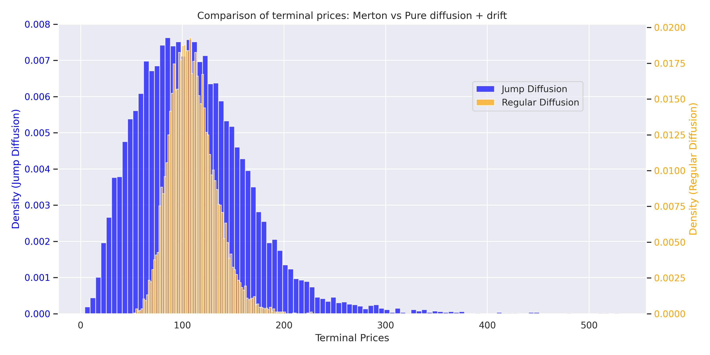
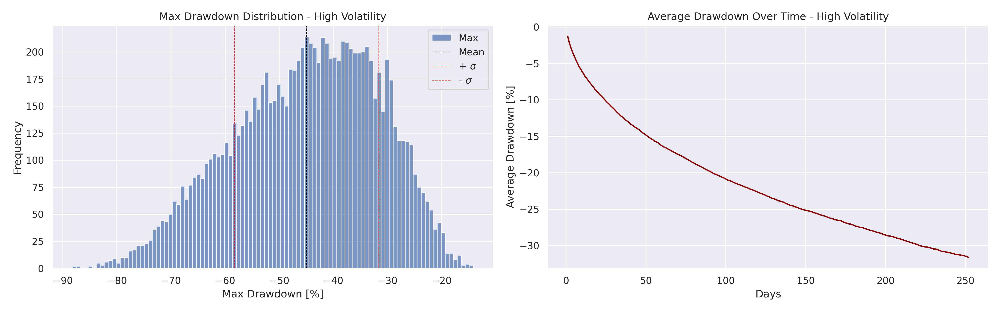

## Objective

These notes aim to give intuition on analyzing processes that mimic cryto price dynamics. Such prices are often characterized by high volatility and discontinuous jumps driven by various factors like breaking news, regulatory changes, or market sentiment shifts.

I will use the framework of Stochastic Calculus (Itô calculus) extended to jump processes. The primary goal here is to build intuition rather than going into the hard math.

## Baseline: Black-Scholes Model

A foundational model is the Black-Scholes model. Here, a description based on the price $S_t$ over time $t$ is given by:

$$
dS_t = \mu S_t dt + \sigma S_t dW_t
$$

where:
*   $S_t$: The asset price at time $t$.
*   $\mu$: The expected rate of return (drift), i.e. expected growth rate of the asset, compensating for the systematic risk.
*   $\sigma$: The volatility of returns. A measure of inherent riskiness, i.e. uncertainty.
*   $dW_t$: The Wiener process / Brownian Motion.

Often, it's more convenient to work with the logarithm of the price, $X_t = \ln(S_t)$. Using Itô's lemma, the dynamics for the log-price become:

$$
dX_t = (\mu - \frac{1}{2} \sigma^2) dt + \sigma dW_t
$$

> [!NOTE]
> The term $\frac{1}{2} \sigma^2$ arises from Itô's lemma. It ends up adjusting the drift in log space. 

## Adding Jumps: Merton's Jump-Diffusion Model

So far so good, the Black-Scholes is a nice baseline, but real-world assets, especially volatile ones like cryptocurrencies have sudden jumps not captured by continuous dynamics. Merton's model extends Black-Scholes by adding a jump component.

The core idea is to model jumps using a *compound Poisson process*. This assumes that significant **events** causing price jumps occur randomly according following a Poisson process, the magnitude being also random. 

Let $N_t$ be a Poisson process with intensity $\lambda$.
*   $N_t$: Counts the number of jumps that have occurred up to time $t$.
*   $\lambda$: The average arrival rate of jumps (e.g., per year), reflecting frequency of events. 

Let $Y_i$ be the size of the $i$-th jump in the *log-space*. We assume these jump sizes i.i.d, $Y \sim N(\mu_J, \sigma_J^2)$, and independent of $N_t$ and $W_t$.
*   $\mu_J$: The average log-jump size. A positive $\mu_J$ indicates jumps tend to be upward on average, while a negative value suggests downward jumps.
*   $\sigma_J$: The standard deviation of log-jump sizes, representing the uncertainty or variability in the magnitude of jumps.

The SDE for the asset price $S_t$ under Merton's model is given by:

$$
dS_t = \mu S_{t-} dt + \sigma S_{t-} dW_t + S_{t-}(e^Y - 1) dN_t
$$

*   $S_{t-}$: Denotes the price just *before* a potential jump at time $t$.
*   $(e^Y - 1)$: Represents the *relative* price change caused by a jump of log-size $Y$. 
> [!IMPORTANT]
> Let $Y$ a *log*-jump size from $S_{t-}$ to $S_t$, i.e., $S_{t} = S_{t-} e^Y$, so the change $S_{t} - S_{t-} \equiv S_{t-}e^Y - S_{t-} = S_{t-}(e^Y - 1)$.
*   $dN_t$: The increment of the Poisson process. Over a small interval $dt$, $dN_t$ is approximately 1 with probability $\lambda dt$ (a jump occurs) and 0 otherwise.
> [!IMPORTANT]
> The intution comes from $\mathbb{P}(dN_t = 1) = e^{-\lambda dt} \approx 1 + o(dt)$ and $\mathbb{P}(dN_t \geq 2) \approx o(dt)$, therefore, a binomial distribution in the limit. 

Applying the extended [Itô's lemma for jump-diffusion processes](https://personal.ntu.edu.sg/nprivault/MA5182/stochastic-calculus-jump-processes.pdf) to $X_t = \ln(S_t)$, we get the dynamics for the log-price:

$$
dX_t = (\mu - \frac{1}{2} \sigma^2) dt + \sigma dW_t + Y dN_t
$$

## Martingale Compensation

The process $X_t$ above is not a martingale, the jump term $Y dN_t$ has a non-zero expected value $E(Y dN_t) = E(Y) E(dN_t) = \mu_J (\lambda dt)$.

*Now, the martingale property is a serious thing, it defines a risk-neutral measure*, a core requirements when a market is arbitrage free.

Therefore, we will **compensate** the process $N_t$ by adjusting the drift to account for the expected contribution of the jumps.

The compensated process is given by:

$$
dX_t = (\mu - \frac{1}{2} \sigma^2 - \lambda \kappa) dt + \sigma dW_t + Y dN_t
$$

Where $\kappa = E(e^Y - 1)$ is the expected *relative* price jump.
*   $\kappa$: Represents the average percentage change in price expected *per jump*.
*   $\lambda \kappa$: Represents the total expected drift contribution *per unit time* from all jumps.

For $Y \sim N(\mu_J, \sigma_J^2)$, the expected value of $e^Y$ is $E(e^Y) = e^{\mu_J + \sigma_J^2/2}$ (direct application of MGF). Therefore:

$$
\kappa = e^{\mu_J + \sigma_J^2/2} - 1
$$

Let's define the compensated drift as $\mu'$:

$$
\mu' = \mu - \frac{1}{2} \sigma^2 - \lambda \kappa = \mu - \frac{1}{2} \sigma^2 - \lambda (e^{\mu_J + \sigma_J^2/2} - 1)
$$

The compensated SDE becomes:

$$
dX_t = \mu' dt + \sigma dW_t + Y dN_t
$$

> [!IMPORTANT]
> The term $Y dN_t$ represents the jump itself. For a small interval $\Delta t$, the probability of one jump ($\Delta N_t = 1)$ is $\approx 1$ and the probability of more than one jump is negligible ($o(\Delta t)$). Thus, $Y dN_t$ effectively adds a random jump of size $Y$ to $X_t$ whenever it jumps.

## Statistical Properties of Log-Returns

Let's look at key statistical moments of the log-price process $X_t = \ln S_t$, assuming $X_0 = \ln S_0$ is the initial log-price. We use the compensated process for these calculations.

The total change $X_t - X_0$ can be written as:

$$
X_t - X_0 = \int_0^t \mu' ds + \int_0^t \sigma dW_s + \int_0^t Y dN_s = \mu' t + \sigma W_t + \sum_{i=1}^{N_t} Y_i
$$

*   **Mean:** $E(X_t)$
    The expected log-price reflects the overall trend
    $$
    E(X_t) = X_0 + \mu' t + \lambda t \mu_J
    $$

    Substituting $\mu'$:

    $$
    E(X_t) = X_0 + (\mu - \frac{1}{2}\sigma^2 - \lambda(e^{\mu_J + \sigma_J^2/2} - 1) + \lambda \mu_J) t
    $$

    The mean log-price grows linearly with time, driven by the original asset drift $\mu$, adjusted downwards by volatility ($\frac{1}{2}\sigma^2$) and the expected relative jump size ($\lambda \kappa$). It is also adjusted upwards ($\lambda \mu_J$).

*   **Variance:** $\text{Var}(X_t)$
    The variance measures the uncertainty around the expected log-price.
    $$
    \text{Var}(X_t) = \sigma^2 t + \lambda t (\mu_J^2 + \sigma_J^2)
    $$

*   **Skewness:** $\text{Skew}(X_t)$
    Skewness measures the asymmetry of the distribution of log-returns. A skewness of 0 indicates symmetry. Positive skewness implies a longer tail on the right, while negative skewness implies a longer left tail.

    Skewness is derived from the third standardized moment ($\kappa_3$).

    $$
    \kappa_3(X_t) = E((X_t - E(X_t))^3) = \lambda t (\mu_J^3 + 3\mu_J\sigma_J^2)
    $$

    The skewness coefficient $\gamma_1$ is:

    $$
    \gamma_1 = \frac{\kappa_3(X_t)}{(\text{Var}(X_t))^{3/2}} = \frac{\lambda t (\mu_J^3 + 3\mu_J\sigma_J^2)}{(\sigma^2 t + \lambda t E(Y^2))^{3/2}} = \frac{\lambda (\mu_J^3 + 3\mu_J\sigma_J^2)}{t^{1/2}(\sigma^2 + \lambda E(Y^2))^{3/2}}
    $$

*   **Kurtosis:** $\text{Kurt}(X_t)$
    Kurtosis measures the *tailedness* of the distribution compared to a normal distribution. The *excess kurtosis* ($\gamma_2$) is also used, defined as $\text{Kurtosis} - 3$. A positive excess kurtosis ($\gamma_2 > 0$) indicated heavier tails and sharper peaks compared to the normal distribution. Jumps are the main source of kurtosis.

    Excess kurtosis is derived from the fourth standardized moment $\kappa_4$.

    $$
    \kappa_4(X_t) = \lambda t (\mu_J^4 + 6\mu_J^2\sigma_J^2 + 3\sigma_J^4)
    $$
    The excess kurtosis coefficient $\gamma_2$ is given by:

    $$
    \gamma_2 = \frac{\kappa_4(X_t)}{(\text{Var}(X_t))^2} = \frac{\lambda t E(Y^4)}{(\sigma^2 t + \lambda t E(Y^2))^2} 
    $$

    $$
    \gamma_2 = \frac{\lambda (\mu_J^4 + 6\mu_J^2\sigma_J^2 + 3\sigma_J^4)}{t (\sigma^2 + \lambda (\mu_J^2 + \sigma_J^2))^2}
    $$

    Fatter tails imply a higher probability of large, sudden gains or losses.

## Euler-Maruyama Discretization for Simulation

To simulate paths of the log-price $X_t$ following the compensated Merton model, we can use the Euler-Maruyama scheme, which approximates the SDE over small time steps $\Delta t$. Let $X_k = X(k \Delta t)$ be the log-price at time step $k$.

The discrete-time update rule is:

$$
X_{k+1} = X_k + \mu' \Delta t + \sigma \sqrt{\Delta t} Z_k + \sum_{j=1}^{\Delta N_k} Y_{k,j}
$$

Where:
*   $\mu' \Delta t$: The deterministic drift component over the interval $\Delta t$.
*   $\sigma \sqrt{\Delta t} Z_k$: The contribution from the continuous diffusion part. $Z_k \sim N(0, 1)$ is a random draw from a standard normal distribution, independent for each step $k$.

*   $\Delta N_k$: The number of jumps occurring in the time interval $(k\Delta t, (k+1)\Delta t)$. $\Delta N_k$ is drawn from a Poisson distribution with parameter $\lambda \Delta t$.

*   $\sum_{j=1}^{\Delta N_k} Y_{k,j}$: The sum of jump sizes occurring in the interval. If $\Delta N_k = 0$, this sum is zero. If $\Delta N_k > 0$, we draw $\Delta N_k$ independent jump sizes $Y_{k,j}$ from the jump size distribution $N(\mu_J, \sigma_J^2)$ and add their sum to the log-price.

> [!NOTE]
> When $\Delta t$ is very small, the Poisson draw $\Delta N_k$ is often approximated by a Bernoulli trial. The probability of exactly one jump is $P(\Delta N_k = 1) \approx \lambda \Delta t$, and the probability of zero jumps is $P(\Delta N_k = 0) \approx 1 - \lambda \Delta t$. The probability of more than one jump is negligible. 

## Impact of Jumps on Distribution Shape

Comparing Merton's model to Black-Scholes highlights two main things jumps-matter!

*   **Fat Tails (Kurtosis):** The jump component introduces excess kurtosis, making extreme events more likely.

*   **Asymmetry (Skewness):** The distribution is asymetrical.

The figures below will illustrate PnL distribution and drawdown resulting from $10_000$ simulations. 

