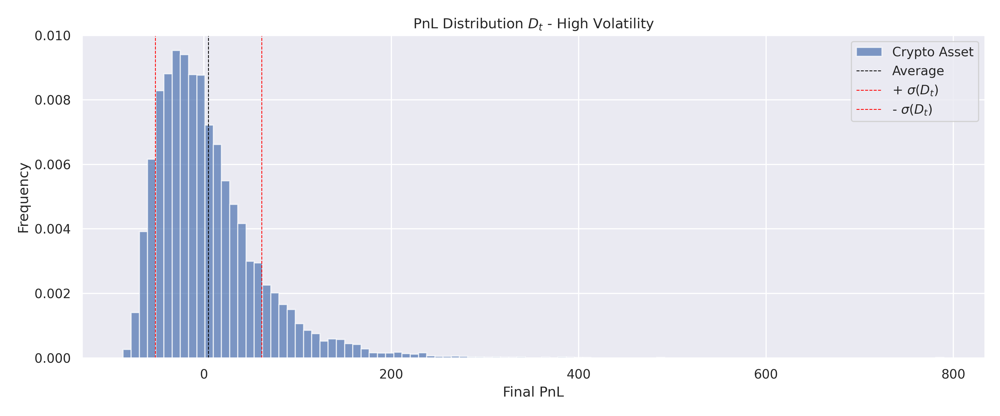

## Objective

These notes aim to provide intuition on analyzing stochastic processes that mimic cryto price evolution. Such assets are often characterized by high volatility and discontinuous price jumps driven by various factors like economic news, regulatory changes, or market sentiment shifts.

I will use the framework of Stochastic Calculus, specifically Itô calculus extended to jump processes. The primary goal here is to build intuition rather than going into the hard details.

## Baseline: Black-Scholes Model

A foundational model is the Black-Scholes model. Here, a description based on the price $S_t$ over time $t$. Its dynamics are given by:

$$
dS_t = \mu S_t dt + \sigma S_t dW_t
$$

Where:
*   $S_t$: The asset price at time $t$.
*   $\mu$: The expected rate of return (drift). Represents the growth rate expected of the asset, compensating for the time value of money and systematic risk.
*   $\sigma$: The volatility of returns. The measure of inherent riskiness or uncertainty.
*   $dW_t$: The Wiener process or Brownian Motion.

Often, it's more convenient to work with the logarithm of the price, $X_t = \ln(S_t)$. Using Itô's lemma, the dynamics for the log-price become:

$$
dX_t = (\mu - \frac{1}{2} \sigma^2) dt + \sigma dW_t
$$

> [!NOTE]
> The term $\frac{1}{2} \sigma^2$ arises from Itô's lemma and is known as the "Itô correction". It adjusts the drift when moving from the asset price $S_t$ to its logarithm $X_t$.

## Incorporating Jumps: Merton's Jump-Diffusion Model

So far so good, the Black-Scholes is a good baseline, but real-world asset prices, especially volatile ones like cryptocurrencies, have sudden jumps not captured by continuous dynamics. Merton's model extends Black-Scholes by adding a jump component.

The core idea is to model jumps using a compound Poisson process. This assumes that significant "events" causing price jumps occur randomly according to a Poisson process, and the magnitude of each jump is also random.

Let $N_t$ be a Poisson process with intensity $\lambda$.
*   $N_t$: Counts the number of jumps that have occurred up to time $t$.
*   $\lambda$: The average arrival rate of jumps (e.g., jumps per year). $\lambda$ reflects the frequency of significant, price-related events for the asset.

Let $Y_i$ be the size of the $i$-th jump in the *log-price*. We assume these jump sizes are independent and identically distributed (i.i.d.), often modeled as normally distributed, $Y \sim N(\mu_J, \sigma_J^2)$, and independent of $N_t$ and $W_t$.
*   $\mu_J$: The average log-jump size. A positive $\mu_J$ indicates jumps tend to be upward on average, while a negative value suggests downward jumps.
*   $\sigma_J$: The standard deviation of log-jump sizes, representing the uncertainty or variability in the magnitude of jumps.

The SDE for the asset price $S_t$ under Merton's model is:

$$
dS_t = \mu S_{t-} dt + \sigma S_{t-} dW_t + S_{t-}(e^Y - 1) dN_t
$$

*   $S_{t-}$: Denotes the price just *before* a potential jump at time $t$.
*   $(e^Y - 1)$: Represents the *relative* price change caused by a jump of log-size $Y$. If the log-price jumps by $Y$, the price $S$ jumps from $S_{t-}$ to $S_{t-} e^Y$, so the change is $S_{t-}e^Y - S_{t-} = S_{t-}(e^Y - 1)$.
*   $dN_t$: The increment of the Poisson process. Over a small interval $dt$, $dN_t$ is approximately 1 with probability $\lambda dt$ (a jump occurs) and 0 otherwise.

Applying the extended Itô's lemma for jump-diffusion processes to $X_t = \ln(S_t)$, we get the dynamics for the log-price:

$$
dX_t = (\mu - \frac{1}{2} \sigma^2) dt + \sigma dW_t + Y dN_t
$$

> [!NOTE]
> The derivation involves considering the effect of both continuous changes (drift and diffusion) and discontinuous changes (jumps) on the function $\ln(S_t)$.

## Martingale Compensation

The process $X_t$ defined above is generally not a martingale, the jump term $Y dN_t$ has a non-zero expected value $E[Y dN_t] = E[Y] E[dN_t] = \mu_J (\lambda dt)$. To make analysis tractable, the process is often "compensated" by adjusting the drift to account for the expected contribution of the jumps.

The compensated log-price process is:

$$
dX_t = (\mu - \frac{1}{2} \sigma^2 - \lambda \kappa) dt + \sigma dW_t + Y dN_t
$$

Where $\kappa = E[e^Y - 1]$ is the expected *relative* price jump.
*   $\kappa$: Represents the average percentage change in price expected *per jump*. If jumps are symmetric in log-space ($\mu_J=0$), $\kappa$ is still positive due to the convexity of the exponential function, meaning jumps (up or down) tend to increase the expected price slightly.
*   $\lambda \kappa$: Represents the total expected drift contribution *per unit time* from all jumps. Subtracting this term removes the predictable part of the jump process from the drift.

For $Y \sim N(\mu_J, \sigma_J^2)$, the expected value of $e^Y$ is $E[e^Y] = e^{\mu_J + \sigma_J^2/2}$ (using the moment-generating function of the normal distribution). Therefore:
$$
\kappa = e^{\mu_J + \sigma_J^2/2} - 1
$$

Let's define the compensated drift as $\mu'$:
$$
\mu' = \mu - \frac{1}{2} \sigma^2 - \lambda \kappa = \mu - \frac{1}{2} \sigma^2 - \lambda (e^{\mu_J + \sigma_J^2/2} - 1)
$$
The compensated SDE becomes:
$$
dX_t = \mu' dt + \sigma dW_t + Y dN_t
$$

> [!IMPORTANT]
> The term $Y dN_t$ represents the jump itself. In a small time interval $dt$, the probability of one jump ($\Delta N_t = 1$) is approximately $\lambda dt$, and the probability of more than one jump is negligible ($o(dt)$). Thus, $Y dN_t$ effectively adds a random jump of size $Y$ to $X_t$ whenever a Poisson event occurs.

## Statistical Properties of Log-Returns ($X_t$)

Let's analyze the key statistical moments of the log-price process $X_t = \ln S_t$, assuming $X_0 = \ln S_0$ is the initial log-price. We use the compensated process for these calculations.

The total change $X_t - X_0$ can be written as:
$$
X_t - X_0 = \int_0^t \mu' ds + \int_0^t \sigma dW_s + \int_0^t Y dN_s = \mu' t + \sigma W_t + \sum_{i=1}^{N_t} Y_i
$$

*   **Mean (Expected Value):** $E[X_t]$
    The expected log-price reflects the overall trend, combining the compensated drift and the average impact of jumps.
    $$
    E[X_t] = X_0 + E[\mu' t] + E[\sigma W_t] + E[\sum_{i=1}^{N_t} Y_i]
    $$
    Since $E[W_t] = 0$ and using Wald's identity $E[\sum_{i=1}^{N_t} Y_i] = E[N_t]E[Y] = (\lambda t) \mu_J$:
    $$
    E[X_t] = X_0 + \mu' t + \lambda t \mu_J
    $$
    Substituting $\mu'$:
    $$
    E[X_t] = X_0 + (\mu - \frac{1}{2}\sigma^2 - \lambda(e^{\mu_J + \sigma_J^2/2} - 1) + \lambda \mu_J) t
    $$
    *Economically*: The mean log-price grows linearly with time, driven by the original asset drift $\mu$, adjusted downwards by volatility ($\frac{1}{2}\sigma^2$) and the expected relative jump size ($\lambda \kappa$), and adjusted upwards by the average log-jump size ($\lambda \mu_J$).

*   **Variance:** $\text{Var}(X_t)$
    The variance measures the dispersion or uncertainty around the expected log-price. It combines the uncertainty from continuous fluctuations and discrete jumps.
    $$
    \text{Var}(X_t) = \text{Var}(\mu' t + \sigma W_t + \sum_{i=1}^{N_t} Y_i)
    $$
    Since $\mu't$ is deterministic, and $W_t$ and the compound Poisson process $\sum Y_i$ are independent:
    $$
    \text{Var}(X_t) = \text{Var}(\sigma W_t) + \text{Var}(\sum_{i=1}^{N_t} Y_i)
    $$
    We know $\text{Var}(\sigma W_t) = \sigma^2 t$. Using Wald's identity for variance:
    $\text{Var}(\sum_{i=1}^{N_t} Y_i) = E[N_t]\text{Var}(Y) + \text{Var}(N_t)(E[Y])^2 = (\lambda t) \sigma_J^2 + (\lambda t) \mu_J^2 = \lambda t (\mu_J^2 + \sigma_J^2)$.
    Note that $E[Y^2] = \text{Var}(Y) + (E[Y])^2 = \sigma_J^2 + \mu_J^2$. So, $\text{Var}(\sum Y_i) = \lambda t E[Y^2]$.
    $$
    \text{Var}(X_t) = \sigma^2 t + \lambda t (\mu_J^2 + \sigma_J^2) = \sigma^2 t + \lambda t E[Y^2]
    $$
    *Economically*: The total variance grows linearly with time. It's the sum of variance from the continuous diffusion part ($\sigma^2 t$, standard market noise) and variance from the jump part ($\lambda t E[Y^2]$, risk from sudden events). The jump variance depends on both the frequency of jumps ($\lambda$) and their magnitude (captured by $E[Y^2]$).

*   **Skewness:** $\text{Skew}(X_t)$
    Skewness measures the asymmetry of the distribution of log-returns. A skewness of 0 (like a normal distribution) indicates symmetry. Positive skewness implies a longer tail on the right (more large positive returns than large negative ones), while negative skewness implies a longer left tail. Jumps can introduce skewness, especially if the average jump size $\mu_J$ is non-zero.
    Skewness is derived from the third standardized moment (or third cumulant $\kappa_3$).
    $\kappa_3(X_t) = E[(X_t - E[X_t])^3] = \kappa_3(\sigma W_t) + \kappa_3(\sum Y_i)$.
    Since $W_t$ is Gaussian, $\kappa_3(\sigma W_t) = 0$.
    $\kappa_3(\sum_{i=1}^{N_t} Y_i) = E[N_t] E[Y^3] = \lambda t E[Y^3]$.
    For $Y \sim N(\mu_J, \sigma_J^2)$, the third central moment is $E[(Y-\mu_J)^3] = 0$, but the third moment $E[Y^3]$ is generally non-zero: $E[Y^3] = \mu_J^3 + 3\mu_J\sigma_J^2$.
    $$
    \kappa_3(X_t) = \lambda t (\mu_J^3 + 3\mu_J\sigma_J^2)
    $$
    The skewness coefficient $\gamma_1$ is:
    $$
    \gamma_1 = \frac{\kappa_3(X_t)}{(\text{Var}(X_t))^{3/2}} = \frac{\lambda t (\mu_J^3 + 3\mu_J\sigma_J^2)}{(\sigma^2 t + \lambda t E[Y^2])^{3/2}} = \frac{\lambda (\mu_J^3 + 3\mu_J\sigma_J^2)}{t^{1/2}(\sigma^2 + \lambda E[Y^2])^{3/2}}
    $$
    *Economically*: If the average log-jump size $\mu_J$ is non-zero, the distribution of log-returns becomes skewed. A positive $\mu_J$ (average jumps are upwards) leads to positive skewness, while a negative $\mu_J$ leads to negative skewness. If $\mu_J = 0$, the skewness introduced by normally distributed jumps is zero. The skewness decreases as the time horizon $t$ increases, as the diffusion component becomes relatively more dominant.

*   **Kurtosis:** $\text{Kurt}(X_t)$
    Kurtosis measures the "tailedness" or peakedness of the distribution compared to a normal distribution. The *excess kurtosis* ($\gamma_2$) is often reported, defined as $\text{Kurtosis} - 3$. A positive excess kurtosis ($\gamma_2 > 0$) indicates a leptokurtic distribution (heavier tails and a sharper peak than a normal distribution), while $\gamma_2 = 0$ for a normal distribution. Jumps are a primary source of leptokurtosis in financial returns.
    Excess kurtosis is derived from the fourth standardized moment (or fourth cumulant $\kappa_4$).
    $\kappa_4(X_t) = E[(X_t - E[X_t])^4] - 3(\text{Var}(X_t))^2 = \kappa_4(\sigma W_t) + \kappa_4(\sum Y_i)$.
    Since $W_t$ is Gaussian, $\kappa_4(\sigma W_t) = 0$.
    $\kappa_4(\sum_{i=1}^{N_t} Y_i) = E[N_t] E[Y^4] = \lambda t E[Y^4]$.
    For $Y \sim N(\mu_J, \sigma_J^2)$, the fourth moment is $E[Y^4] = \mu_J^4 + 6\mu_J^2\sigma_J^2 + 3\sigma_J^4$.
    $$
    \kappa_4(X_t) = \lambda t (\mu_J^4 + 6\mu_J^2\sigma_J^2 + 3\sigma_J^4)
    $$
    The excess kurtosis coefficient $\gamma_2$ is:
    $$
    \gamma_2 = \frac{\kappa_4(X_t)}{(\text{Var}(X_t))^2} = \frac{\lambda t E[Y^4]}{(\sigma^2 t + \lambda t E[Y^2])^2} = \frac{\lambda E[Y^4]}{t (\sigma^2 + \lambda E[Y^2])^2}
    $$
    Substituting $E[Y^4]$ and $E[Y^2]$:
    $$
    \gamma_2 = \frac{\lambda (\mu_J^4 + 6\mu_J^2\sigma_J^2 + 3\sigma_J^4)}{t (\sigma^2 + \lambda (\mu_J^2 + \sigma_J^2))^2}
    $$
    *Economically*: The presence of jumps ($\lambda > 0$) always introduces positive excess kurtosis ($\gamma_2 > 0$), meaning the distribution of log-returns has "fatter tails" than a normal distribution. This reflects the real-world observation that extreme price movements (both positive and negative) are more common than predicted by the Black-Scholes model. The fatter tails imply a higher probability of large, sudden gains or losses. Similar to skewness, the excess kurtosis decreases as the time horizon $t$ increases.

## Euler-Maruyama Discretization for Simulation

To simulate paths of the log-price $X_t$ following the compensated Merton model, we can use the Euler-Maruyama scheme, which approximates the SDE over small time steps $\Delta t$. Let $X_k = X(k \Delta t)$ be the log-price at time step $k$.

The discrete-time update rule is:
$$
X_{k+1} = X_k + \mu' \Delta t + \sigma \sqrt{\Delta t} Z_k + \sum_{j=1}^{\Delta N_k} Y_{k,j}
$$

Where:
*   $\mu' \Delta t$: The deterministic drift component over the interval $\Delta t$.
*   $\sigma \sqrt{\Delta t} Z_k$: The contribution from the continuous diffusion part. $Z_k \sim N(0, 1)$ is a random draw from a standard normal distribution, independent for each step $k$. The scaling by $\sqrt{\Delta t}$ is characteristic of Brownian motion increments.
*   $\Delta N_k$: The number of jumps occurring in the time interval $[k\Delta t, (k+1)\Delta t]$. $\Delta N_k$ is drawn from a Poisson distribution with parameter $\lambda \Delta t$, i.e., $\Delta N_k \sim \text{Poisson}(\lambda \Delta t)$.
*   $\sum_{j=1}^{\Delta N_k} Y_{k,j}$: The sum of jump sizes occurring in the interval. If $\Delta N_k = 0$, this sum is zero. If $\Delta N_k > 0$, we draw $\Delta N_k$ independent jump sizes $Y_{k,j}$ from the jump size distribution $N(\mu_J, \sigma_J^2)$ and add their sum to the log-price.

> [!NOTE]
> For simulation purposes, especially when $\Delta t$ is very small such that $\lambda \Delta t \ll 1$, the Poisson draw $\Delta N_k$ is often approximated by a Bernoulli trial. The probability of exactly one jump is $P(\Delta N_k = 1) \approx \lambda \Delta t$, and the probability of zero jumps is $P(\Delta N_k = 0) \approx 1 - \lambda \Delta t$. The probability of more than one jump is negligible. In this approximation, at each step, we either have no jump or exactly one jump of size $Y \sim N(\mu_J, \sigma_J^2)$.

## Impact of Jumps on Distribution Shape

Comparing Merton's model to Black-Scholes highlights the significant impact of jumps:

*   **Fat Tails (Kurtosis):** The jump component introduces excess kurtosis, making extreme events more likely than under a pure diffusion process. This aligns better with observed financial market behavior, where large crashes or rallies occur more frequently than predicted by normal distributions.
*   **Asymmetry (Skewness):** If the average log-jump size $\mu_J$ is non-zero, the return distribution becomes skewed. For example, if negative news tends to cause larger price drops than positive news causes rallies (negative $\mu_J$), the distribution will exhibit negative skewness.
*   **Discontinuity:** Price paths simulated under Merton's model exhibit sudden gaps or jumps, unlike the continuous paths generated by Black-Scholes.

The figures below will illustrate the Profit and Loss (PnL) distribution and drawdown characteristics resulting from simulations based on this model. The presence of jumps typically leads to PnL distributions with heavier tails and potentially significant skewness compared to the symmetric, bell-shaped distribution predicted by Black-Scholes (log-returns). Drawdown analysis also often reveals the potential for larger, more rapid losses when jumps are included.

