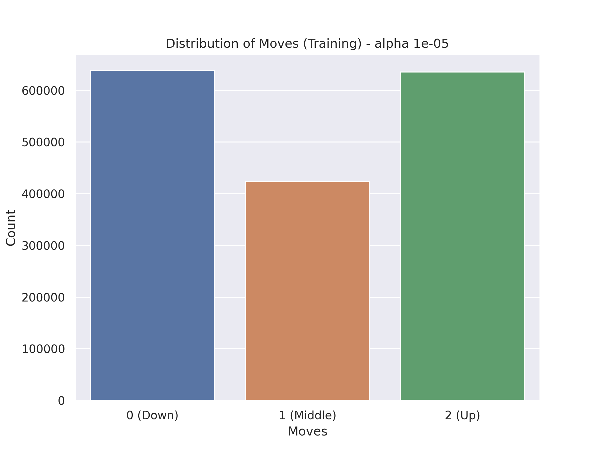
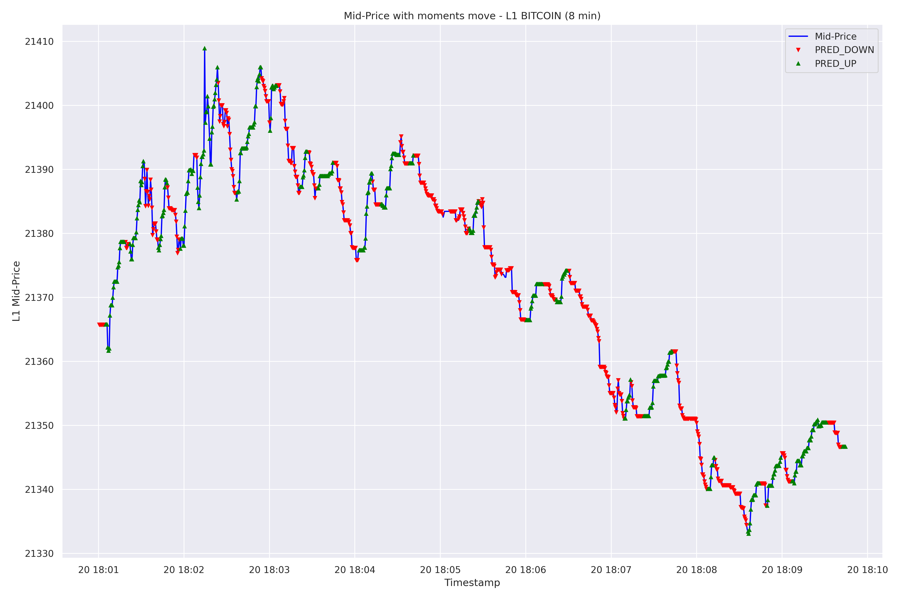
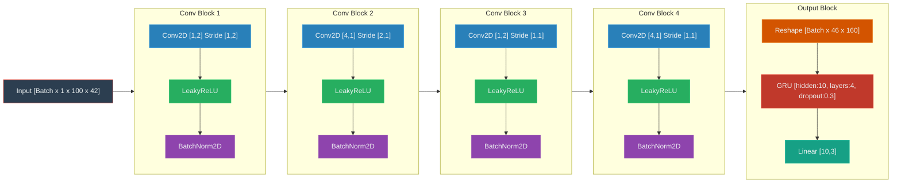
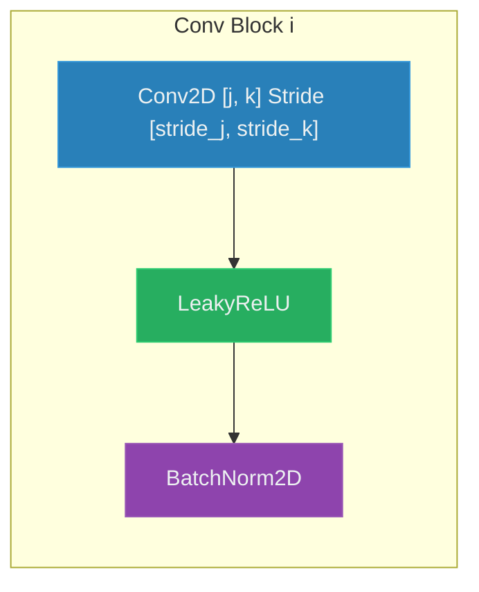
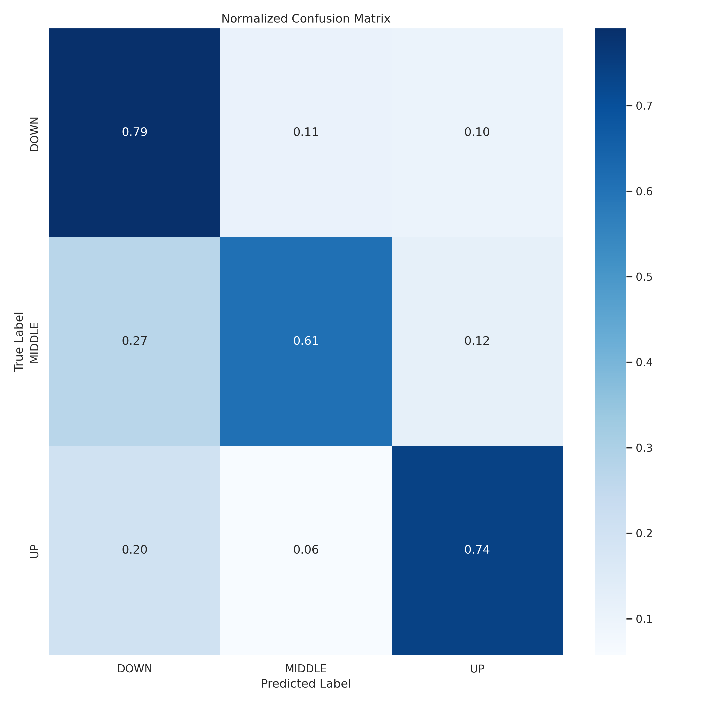
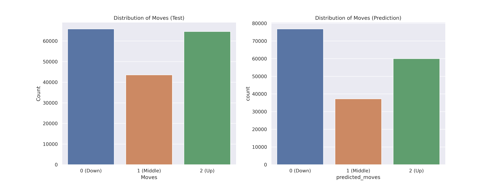

# Hitchhiker
A few weeks ago, I came across the [DeepLOB](https://arxiv.org/pdf/1808.03668) article. I found it quite interesting, especially if you have a rich dataset at hand! My main question was: can something simpler be done in the Crypto market? The reasons were two-fold:
* The original DeepLOB model has over 100K parameters to predict UP, STATIONARY, and DOWN movements, using a rich LOB dataset of over 130M rows. Can these ideas be transferred to a different market? On Kaggle, you can find a suitable 10-Level LOB (BTCUSDT Perpetual) dataset: [Binance-LOB](https://www.kaggle.com/datasets/siavashraz/bitcoin-perpetualbtcusdtp-limit-order-book-data), recording 12 consecutive days from January 9th, 2023, to January 20th, 2023.
* Given the reduction in the magnitude of freely available data compared to the original study, can a significantly simpler model (10x or 12x fewer parameters) be created for the Crypto Market? What about its interpretability?

## LOB dataset
Given my GPU limitations, I decided to downsample the dataset by averaging over 500ms periods. The goal was simple: obtain data points representing 0.5 second intervals. The dataset required only minimal backfilling to end up with 0 NaNs per feature.

### Computing Moves (k)
As in the [DeepLOB](https://arxiv.org/pdf/1808.03668) article, the aim is to predict price movement directions. This is done by computing the L1 mid-price and comparing its average over preceding and succeeding $k$ periods. The definitions are given below:

*Mid-Price Calculation:* The mid-price ($p_t$, at time $t$) is calculated as the average of the best ask price ($p_{ask\_l1}$) and the best bid price ($p_{bid\_l1}$):

$$p_t = \frac{p_{ask\_l1} + p_{bid\_l1}}{2}$$

*Moment Calculation:* Two moving averages are calculated for each time $t$: the average mid-price over the preceding $k$ periods ($moment\_{minus}$) and the succeeding $k$ periods ($moment\_{plus}$):

$$moment\_{minus} = \frac{1}{k} \sum_{i=t-k}^{t-1} p_i,\quad moment\_{plus} = \frac{1}{k} \sum_{i=t+1}^{t+k} p_i$$

> [!NOTE]
> *Handling Out-of-Bound Prices:* If the calculation window extends beyond the available data boundaries, the averages are computed using only the available data points within that window.

*Moment Direction:* The moment direction is computed as the percentage change between `moment_plus` and `moment_minus`:

$$moment\_{direction} = \frac{moment\_{plus} - moment\_{minus}}{moment\_{minus}}$$

If $moment\_{minus}$ is 0, $moment\_{direction}$ is set to 0 to avoid division by zero.

*Move Classification:* The move at time $t$ is classified based on the `moment_direction` and a predefined threshold $\alpha$.

$$
move(t) =
\begin{cases}
  1, & \text{if } moment\_direction > \alpha \\
  -1, & \text{if } moment\_direction < -\alpha \\
  0, & \text{otherwise}
\end{cases}
$$

> [!IMPORTANT]
> Notice that $\alpha$ significantly affects the dataset balance.
> By selecting a low value ($\alpha = 1e-5$), I managed to obtain an acceptably balanced dataset.

The resulting (almost) balanced training dataset distribution for $\alpha = 1e-5$ is shown below.

The classification function effectively captures the significant price movements, as indicated by the moment directions exceeding the $\pm \alpha$ threshold (though further refinement is possible).

The processed dataset contains approximately 1.6M rows and 42 features, consisting of 10 levels of Bid/Ask prices and volumes, the L1 mid-price, and the moment direction feature. The single target column is `moves`.

> [!NOTE]
> In terms of exact sizes:
> Training set features shape: `(1697078, 42)`, target shape: `(1697078,)`
> Testing set features shape: `(174098, 42)`, target shape: `(174098,)`

## Simple DeepLOB

I implemented a simplified version of the DeepLOB model using PyTorch and trained it using the Adam optimizer with a learning rate of 0.003. An important aspect was to keep the model simple while retaining sufficient convolutional layers, as they effectively encode features like volume-adjusted bids/asks and bid-ask spreads/averages. Therefore, each layer serves a specific purpose, which I'll explain below.
The model processes the input data in batches, where each sample includes a time window of the 100 preceding data points (50 seconds), allowing the convolutional layers to capture temporal patterns.

> [!NOTE]
> After some experimentation, I realized that adding dense linear layers after the convolutions did not significantly improve performance on this sequential data. Instead, they increased the parameter count and sometimes led to exploding gradients during training.

The network utilizes convolutional blocks as defined below ($i,j,k$ vary per block). The convolutional layers aim to capture spatial relationships within the LOB data (across different price levels, between bids and asks) and temporal relationships (patterns over the 100-step time window).

Therefore:

*   [`Conv Block 1`]: Uses a kernel of `(1, 2)` with a stride of `(1, 2)`. This configuration processes pairs of l-level bid/ask and its corresponding volume, computing volume-adjusted bids/asks. This effectively performs a 'spatial' convolution across the feature dimension. LeakyReLU activation and `BatchNorm2D` provide non-linearity and stabilization.
*   [`Conv Block 2`]: Employs a kernel of `(4, 1)` with a stride of `(2, 1)`. This layer captures short-term temporal dependencies in the features generated by Block 1 (volume-adjusted bids/asks). The stride of `(2, 1)` downsamples the temporal dimension.
*   [`Conv Block 3`]: Similar to Block 1, this uses a `(1, 2)` kernel (but with stride `(1, 1)`) to further process features spatially, capturing relationships between the volume adjusted bids and asks generated by Block 2, it implicitely computes fair values.. Uses LeakyReLU (typo `Leazy` corrected) and `BatchNorm2D`.
*   [`Conv Block 4`]: Analogous to Block 2, this block uses a `(4, 1)` kernel (stride `(1, 1)`) to capture further temporal patterns in the compressed volume adjusted fair values created by Block 3.
*   [`Output Block`]: The preceding convolutional blocks extract spatial and temporal features from the LOB data. The output is reshaped and fed into a GRU layer. The GRU is chosen to model the sequential nature of the extracted features and capture longer-term dependencies. While LSTM can be used, the GRU is used for their *computational efficiency*, fewer gates, fewer parameters, reducing risk of overfitting. The final linear layer maps the GRU's state output to the three prediction classes (UP: 1, DOWN: -1, STATIONARY: 0).

The total number of parameters of the model: 7777

## Results
The training was not that easy, I encountered oscillatory behavior on the residual and validation errors after a few epochs. Nonetheless, using early stopping at an epoch with low residual a nice confusion matrix can be obtained.

Its associated prediction distribution is skewed, something that requires further research. 

Overall, the results are interesting, indicating that patterns exist in the LOB data that can be exploited for short-term price direction prediction, even with this simplified model.