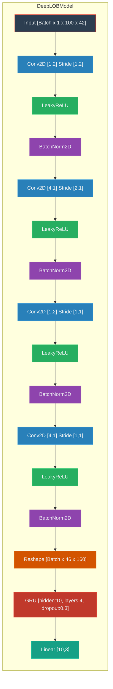

# Hitchhiker
There are notes on different efforts to (attempt) predicting crypto's movements.
So far, to this end, I'll be relying primarily on freely available datasets, nonetheless, paid data is on sight...

A few weeks ago, I came across the [DeepLOB](https://arxiv.org/pdf/1808.03668) article. Interestingly enough, after reading it, I got curious of replicating a simpler model. The reasons were two-fold:
* The original DeepLOB has over 100K parameters, to predict UP, STATIONARY, DOWN movements, using a rich LOB dataset of over 130M rows. Can something similar be done for the Crypto market?. Here is a 10 Level LOB BTCUSD from Binance [Binance-LOB](https://www.kaggle.com/datasets/siavashraz/bitcoin-perpetualbtcusdtp-limit-order-book-data) recoding 12 consecutive days, starting from January 9th, 2023, until January 20th, 2023,
* Given the reduction in magnitude of freely-available data, can a 10x simpler model for the Crypto Market be created to predict the three moments as in the DeepLOB?

## LOB dataset
Given my limitation on GPU, I decided to downsample to 500ms the dataset through averages of each period. To goal was simple. Have a roughly averaged look per 0.5 (s). The dataset was nice enough to only require a backfilling to endup with 0 NaNs per feature. 

### Computing Moves (k)
As done in [DeepLOB](https://arxiv.org/pdf/1808.03668) article, the aim is to predict movement directions by computing 
mid prices (L1 Bid/Ask mid price) and averaged mid prices over past and future $k$ periods. The definition are given below:

*Mid-Price Calculation:* The mid-price ($p_t$, at time $t$) is calculated as the average of the best ask price ($p_{ask\_l1}$) and 
the best bid price ($p_{bid\_l1}$):

$$p_t = \frac{p_{ask\_l1} + p_{bid\_l1}}{2}$$

*Moment Calculation:* Two moments are calculated for each time $t$. The average mid-price over the past (future) $k$ periods:

$$moment\_minus = \frac{1}{k} \sum_{i=t-k}^{t-1} p_i,\quad moment\_plus = \frac{1}{k} \sum_{i=t+1}^{t+k} p_i$$

> [!NOTE] 
> *Handling Out-of-Bound Prices* If the calculation window extends beyond the available data, the moments are adjusted to the remaining dataset.

*Moment Direction:* The moment direction is computed as the percentage change between `moment_plus` and `moment_minus`:

$$moment\_direction = \frac{moment\_plus - moment\_minus}{moment\_minus}$$

If $moment\_minus$ is 0, $moment\_direction$ is set to 0 to avoid division by zero.

*Move Classification:* The move at time $t$ is classified based on the `moment_direction` and a predefined threshold $\alpha$.

$$
move(t) =
\begin{cases}
  1, & \text{if } moment\_direction > \alpha \\
  -1, & \text{if } moment\_direction < -\alpha \\
  0, & \text{otherwise}
\end{cases}
$$

> [!IMPORTANT]
> Notice that $\alpha$ has serious effects on the dataset imbalance. 
> By ensuring a low value, I managed to get a (okay-ish) balanced one. 

The (almost)-balanced dataset for $\alpha = 1e-5$ is given below.

The movements are nicely captured by the classification function (it can be improved further), as seen in the moment directions out of the threshold $\pm \alpha$.

The processed dataset contains $\approx$ 1.6M rows and 42 features, consisting of 10 levels (Bid/Aks) + l1 mid-price + moment-direction, and a single target column: `moves`.

> [!NOTE]
> In terms of exact sizes, the training set had shape `(1697078, 42)` and its target: `(1697078,)`
> The testing set `(174098, 42)`, and its target: `(174098,)` 

## Simple DeepLOB

I implemented a simplified version of the DeepLOB model (using torch) and trained it using Adam method, learning rate (0.003). An important aspect was to keep the model simple, but also keep enough convolution layers, as they nicely encoded volume-adjusted bids and asks, as well as bid-ask averages. Therefore, each layer had a purpose, which I'll explain.

>[!NOTE] After some experimentation I quickly realize that linear layers did not help with the recurrent nature of the series, and instead introduced more parameters leading to exploding gradients. 

The total number of parameters of the model: 7777

## Results
The training was not that easy, I encountered oscillatory behavior on the residual and validation errors after a few epochs, nonetheless, with early stopping at an epoch with low residual, a nice confusion matrix can be obtained.

Its associated prediction distribution is skewed, something that requires further study. 

So far, this is interesting, there are patterns to be exploited, and clearly potential direction predictions in short timestamps.